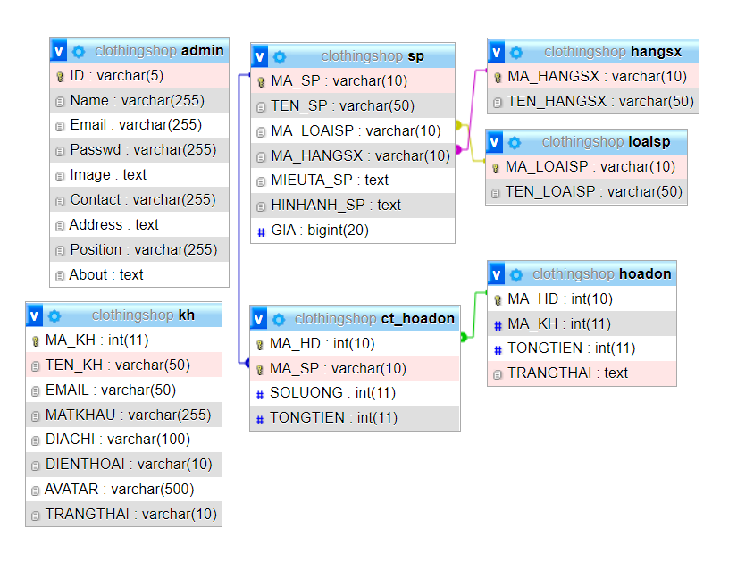
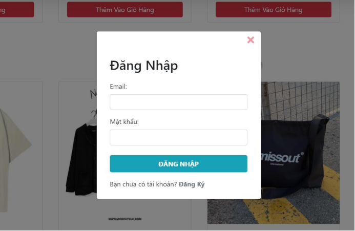
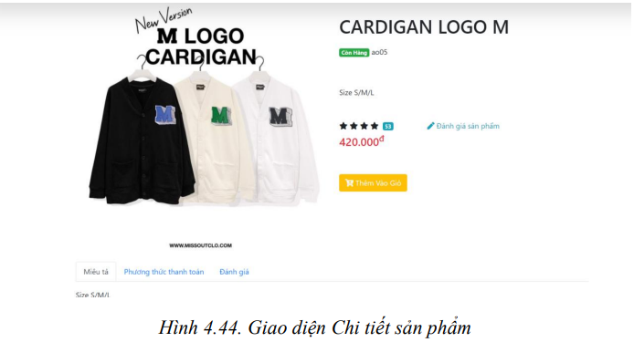
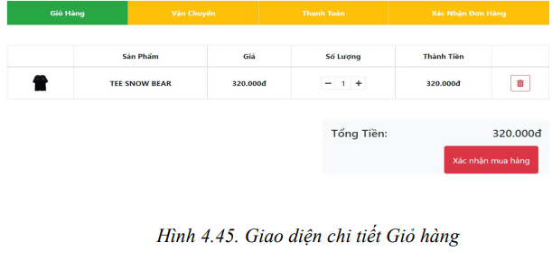
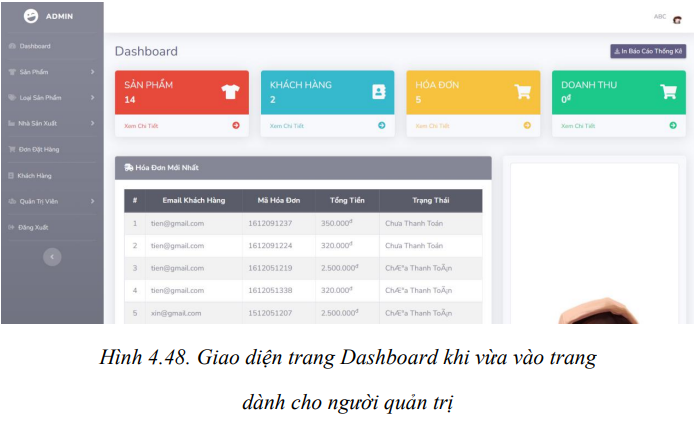
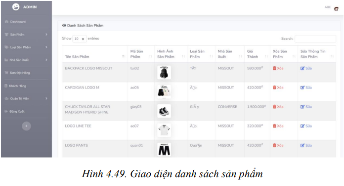

# Phân tích thiết kế hướng đối tượng - Website bán quần áo


 

## Thành viên nhóm

| STT |    MSSV    | Họ và tên             |
| :-: | :--------: | --------------------- |
|  1  | 3119410446 | Ngô Thị Bảo Trâm          |
|  2  | 3119410439 | Minh Hiếu Calan Tog   |
|  3  | 3119410063 | Đặng Khải Dũng   |
|  4  | 3119410427 | Đặng Thị Kiều Tiên   |
|  5  | 3119410185 | Lý Nhật Khánh   |

## Yêu Cầu:

- Xây dựng website có kết nối db, sử dụng ngôn ngữ php, biết phân tích vẽ các sơ đồ từ vấn đề/bài toán đưa ra <br/>

## Database




## Hướng dẫn cài đặt

Phần mềm chạy tốt với độ phân giải màn hình chuẩn của máy là > 1280x900 ( FullHD )

```
1. Tạo database "clothingshop" và import file "db/clothingshop.sql" vào phpadmin trên XAMPP .
```

```
2. Chạy web bằng đường dẫn: "http://localhost/PTTK_HDT-website_ban_quan_ao"
```

## Một số giao diện của website






